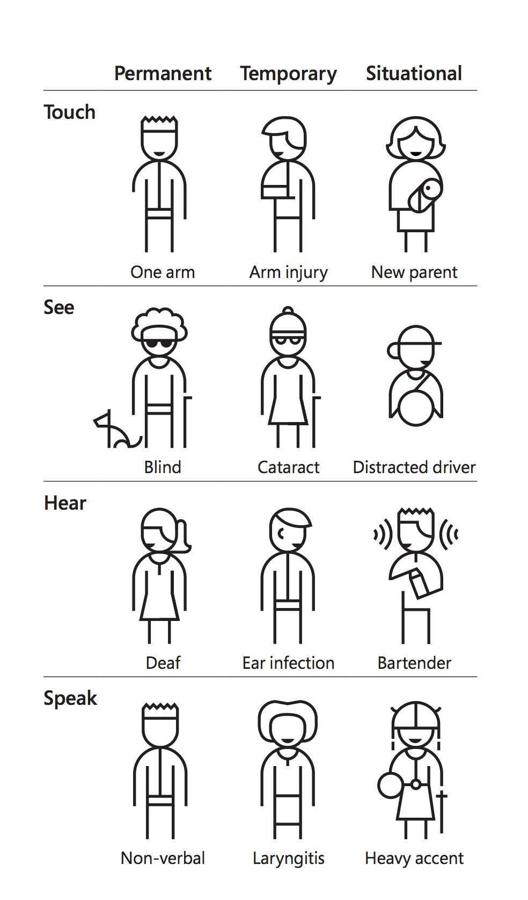
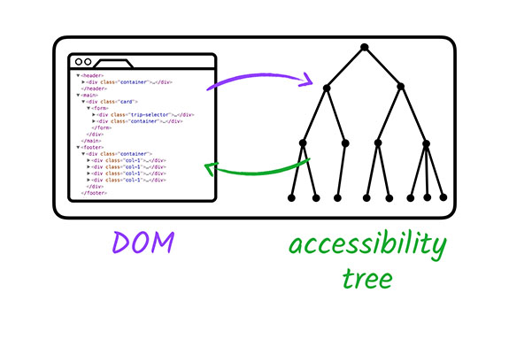
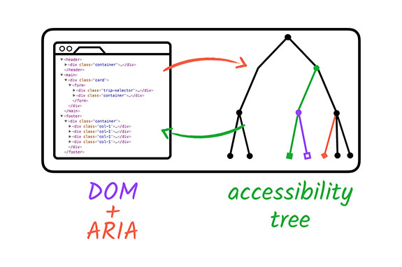
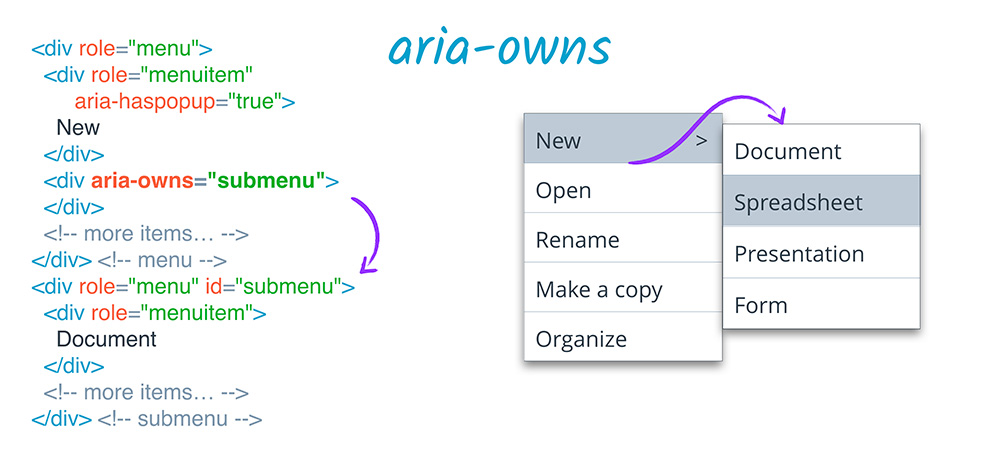

# Accessible Web Mapping Apps

- Kelly Hutchins  
- Tao Zhang

## What is accessibility?

Make content usable for everyone regardless of abilities.

## Wide range of disabilities



## Why is accessibility important?

- The ADA and Section 508
- People with different abilities should have equal access
- Good accessibility is good user experience

## How is Esri doing?

- Reviewing products internally for compliance
- Fixing accessibility issues
- Working accessibility into new features
- Sharing knowledge and best practices

## Web Content Accessibility Guidelines

<WCAG 2.0 and 2.1 images>

## WCAG 2.1

17 additional success criteria to address:

- mobile accessibility
- people with low vision
- people with cognitive and learning disabilities

Reference: [What’s New in WCAG 2.1](https://www.w3.org/WAI/standards-guidelines/wcag/new-in-21/)

## What we will cover today

- Semantics
- Focus and keyboard access
- ARIA and custom components
- Dev tools
- App demos

## Semantics

Choose the right HTML element to reflect content structure and meaning.

Accessibility advocates aren't yelling at developers to use semantic HTML because it's exciting, but because it's well understood how users benefit from it.

## Structure

There is a common understanding of what each element represents and does. For example the `<p>` tag represents a paragraph of static text, an `<a>` element is interactive and will fetch a new resource when activated. This common understanding enables browsers and other user agents to provide default functionality and styling for many elements.

## Structure example

```html
<h2>Popup settings</h2>
```

versus

```html
<span class="heading-2">Popup settings</span>
```

Note: The browser does not recognize the second structure as a level 2 heading, and it will not communicate its structural meaning to assistive technologies. The `<span>` element is semantically neutral, so it does not have an implicit role.

### Meaning

Most HTML elements have an implicit role that defines the element’s purpose. For example the `<a>` element has an implicit role of “link”, the `` element’s implicit role is “graphic” or “image” (depending on the platform), and the `<header>` element has an implicit role of “banner”.

## Meaning example

```html
<button>Save changes</button>
```

versus

```html
<div class="btn btn--primary">Save changes</div>
```

Note: The browser does not know that the `<div>` element is intended as a button, and it will not provide expected behavior for button (e.g., Enter and Space key support). The `<div>` element is semantically neutral, so it does not have an implicit role or accessible name.

## No need to reinvent the wheel

For semantic netural elements like `<span>` and `<div>`, it is possible to use CSS, JavaScript, and ARIA (we will cover ARIA later) to polyfill the missing semantic information, and to provide some (but not all) of the styling and behaviors associated with a semantic element. That takes a lot more code, a lot more effort, and it usually results in a very brittle implementation compared to that of a native html element.

HTML semantics are therefore important in two ways:

- consistent understanding of content structure and native behavior;
- a common understanding of the content’s meaning and purpose.

The best thing of all, is that we get those things for free whenever we use HTML as intended.

## Common semantic HTML elements

- `<ul>` or `<ol>`: a series of items in a list
- `<p>`: paragraph
- `<table>`: tabular data
- `<button>`: a clickable button
- `<label>`: text label for a form control

References:

- [An Overview of HTML5 Semantics](https://codepen.io/mi-lee/post/an-overview-of-html5-semantics)
- [HTML elements organized by purpose](https://developer.mozilla.org/en-US/docs/Web/HTML/Element)

## Use `<button>`

When you use `<button>` element for clickable buttons and bind click event listeners to those buttons, you get a lot of functionality for free:

- Buttons are automatically focusable.
- Screen readers will announce the button in focus and offer ways to click the button.
- Space and Enter keys are automatically supported when binding a click event listener to a button.

## Alternatives of `<div>`

- `<section>`
- `<article>`
- `<ul>` or `<ol>`
- `<header>`
- `<footer>`
- `<button>`

Note: A survey of screen reader users in 2017 showed that 80% of respondents will use regions to navigate - but they can only do so if you choose to use them instead of wrapping everything in `<div>`.

## Focus

Focus refers to the singular element in the page that is able to be acted upon via the keyboard. Keyboard users use the Tab key to cycle through focusable elements. At a basic level, we need to make sure that users can visually tell at any time what element is in focus.

## Never remove focus outline

Don't do this:

```css
:focus {
    outline: none;
}
```

The above CSS removes any visible indication of focus for keyboard users. Without proper fallbacks like custom focus styles, our app will be significantly less accessible and usable for keyboard users.

Ensuring that native or custom focus styling is visible is the single most impactful thing that we can do in the area of keyboard accessibility, and it’s often one of the easiest; a simple case of doubling up selectors on the existing `:hover` styling.

If you only do one thing after this presentation, it should be to search for `outline: 0` and `outline: none` in your CSS.

## Focus order

Focus order, or tab order, is the order in which focus proceeds forward and backward through interactive elements via Tab or Shift + Tab.

## Manage focus

- Only focus elements that keyboard users need to interact with.
- Focus should not be trapped at one particular element, except for modal dialogs.

## Set `tabindex`

- `tabindex="0"`: let DOM structure determine focus order.
- `tabindex="-1"`: necessary for programmatically moving focus (e.g., error message, menus, radio buttons, etc.)
- `tabindex="2"`: anti-pattern.

## Focus management example

```html
<menu-list>
<!-- After the user presses the down arrow key, focus the next available child -->
<menu-item tabindex="0">Map</menu-item>

<!-- call .focus() on this element -->
<menu-item tabindex="-1">Layer</menu-item>
<menu-item tabindex="-1">Scene</menu-item>
<menu-item tabindex="-1">Tool</menu-item>
<menu-item tabindex="-1">Data</menu-item>
</menu-list>
```

[CodePen link](https://codepen.io/jimmieego/pen/Obdebp)

## Plan for keyboard interactions

Common interactions may include:

- Exiting the current component
- Submitting
- Moving position or browsing

Common keys to add actions to:

- Enter (keyCode 13)
- Space (keyCode 32)
- Arrow keys (keyCode 37-40)
- ESC (keyCode 27)
- Tab (keyCode 9)

## ARIA

WAI-ARIA: Web Accessibility Initiative – Accessible Rich Internet Applications. This is the specification for increasing accessibility of custom elements. It provides a way for developers to modify and augment accessibility tree from standard DOM.





Note: ARIA doesn't augment any of the element's inherent behavior like focusable and keyboard event listeners. Custom behaviors still need to be implemented.

## Why do we need ARIA?

Certain semantics and design patterns make it impossible to use native HTML semantics. Examples:

- a pop-up menu, no standard HTML element.
- a semantic characteristic "the user needs to know about this as soon as possible"

## ARIA attributes

| Type | Purpose | Examples |
|------|---------|----------|
| **Roles** | Meaning of an element | `tooltip`, `tablist`, `search` |
| **Properties** | Relationships and functions | `aria-required`, `aria-controls`, `aria-label`, `aria-labelledby` |
| **States** | Current interaction states | `aria-checked`, `aria-expanded`, `aria-hidden` |

## ARIA example

This example may be a bit contrived:

```html
<div tabindex="0" class="checkbox checkbox--checked" >
    Show premium content
</div>
```

Note: Sighted users see a checkbox as a result of the CSS. However, non-sighted users will not know this is meant to be a checkbox.

To fix it:

```html
<div tabindex="0" class="checkbox checkbox--checked" role="checkbox" checked aria-checked="true">
    Show premium content
</div>
```

Note: Screen readers will report this as a checkbox.

## Label and description

- `aria-label`: specifies a string as accessible label and overrides native labelling
- `aria-labelledby`: specifies `id` of another element (or a list of `id`s)
- `aria-describedby`: provides accessible description for an element

### `aria-label` example


### `aria-labelledby` example


### `aria-describedby` example


## Relationship

- `aria-controls`: indicates an element "controls" another element
- `aria-owns`: indicates an element should be treated as parent of another separate element

### `aria-controls` example

```html
<div role="scrollbar" aria-controls="main"></div>
<div id="main">
. . .
</div>
```

### `aria-owns` example



## States

- `aria-expanded`: indicates whether the element, or another grouping element it controls, is currently expanded or collapsed.
- `aria-hidden`: excludes current element from assistive technology.

### `aria-expanded` example

```html
<button aria-expanded="false" aria-controls="expandable-list-1">Expand List</button>
<ul id="expandable-list-1">
    <li><a href="http://example.com">Sample Link</a></li>
    <li><a href="http://example.com">Sample Link 2</a></li>
    <li><a href="http://example.com">Sample Link 3</a></li>
</ul>
```

Note: `aria-expanded` should be applied to the element that controls the expandable element:

- `false` if the element is not expanded.
- `true` if the element is expanded.

If the two elements are parent and child, we don't need to do anything special. If we have a `<button>` that controls an expandable element, the `<button>` needs to have `aria-controls` attribute, which accepts an `id` or list of `id`s that are controlled by the `<button>`.

### `aria-hidden` example

```html
<a href="https://www.github.com">
  <i class="fa fa-github" aria-hidden="true"></i>
  View code on GitHub
</a>
```

## ARIA best practices

1. Don't change native semantics, unless you really have to.

Example: We need to implement a heading which is also a button.

Do this:

```html
<h2><button>heading button</button></h2>
```

Don't do this:

```html
<h2 role="button">heading button</h2>
```

2. All interactive elements must be usable with keyboard.

Example: if using `role="button"`, add `tabindex="0"` and support of Enter and Space keys.

3. Don't use `role="presentation"` or `aria-hidden="true"` on a visible and focusable element.

Don't do this:

```html
<button role="presentation">Press me</button>
<button aria-hidden="true">Press me</button>
```

This will result in focusing on "nothing".

4. All interactive elements must have an accessible label or name.

Do this:

```html
<label>
	Email
	<input type="text" placeholder="name@example.com">
</label>
```

## Accessible custom components

References:

- [ArcGIS API for JavaScript](https://developers.arcgis.com/javascript/)
- [WAI-ARIA Authoring Practices](http://w3c.github.io/aria-practices/)
- [The A11Y Project](https://a11yproject.com/)

## Dev tools

- [axe-core](https://github.com/dequelabs/axe-core)
- Chrome: [Accessibility experiment](https://gist.github.com/marcysutton/0a42f815878c159517a55e6652e3b23a)
- Firefox: [Accessibility Inspector](https://developer.mozilla.org/en-US/docs/Tools/Accessibility_inspector)

## App Demos

- [Accessible App of Electric Charging Stations](https://arcgis103.esri.ca/WCAG-Configurable-Template-Test/?appid=e951691e3893444ea64e7c29d086e30c)
- [a11y-map](https://github.com/Esri/a11y-map)